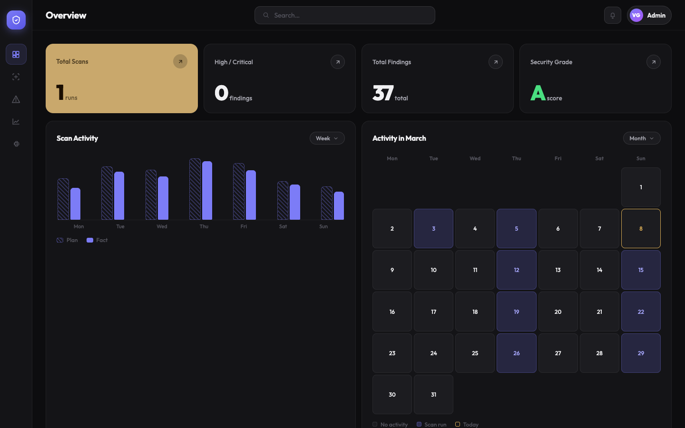
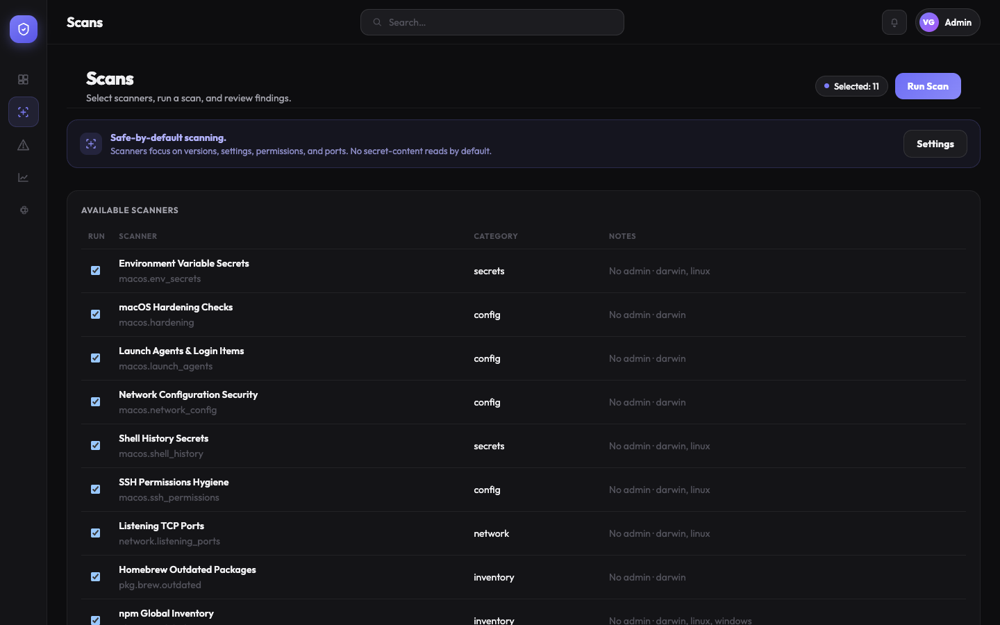
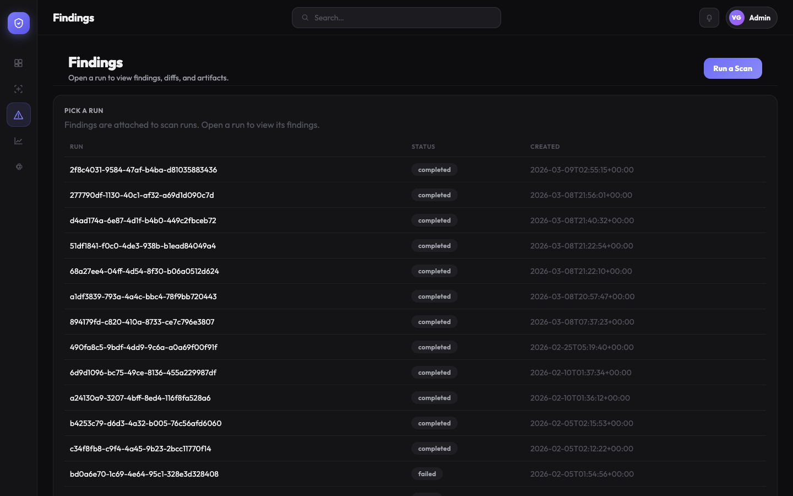
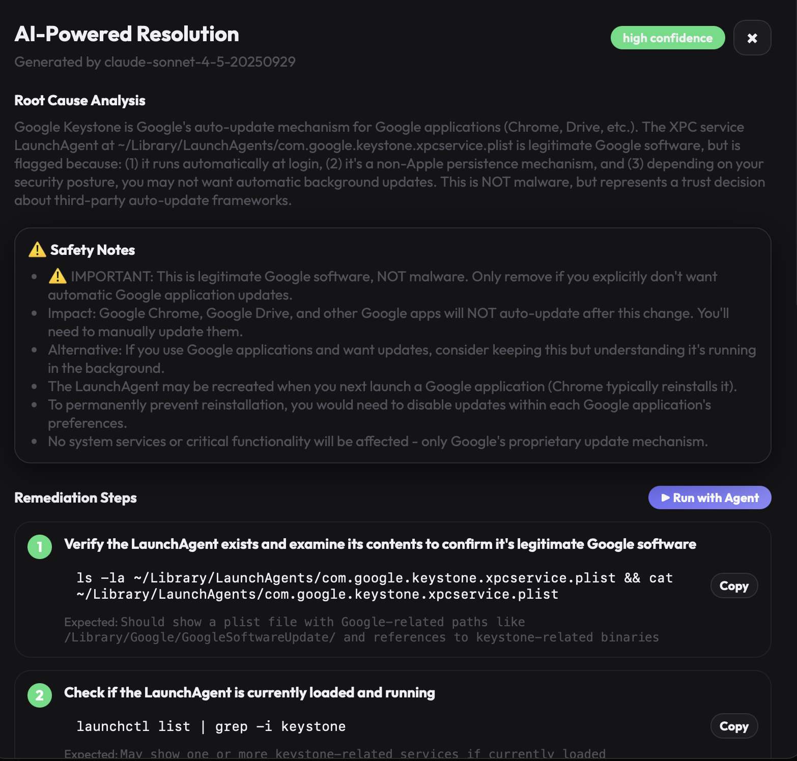
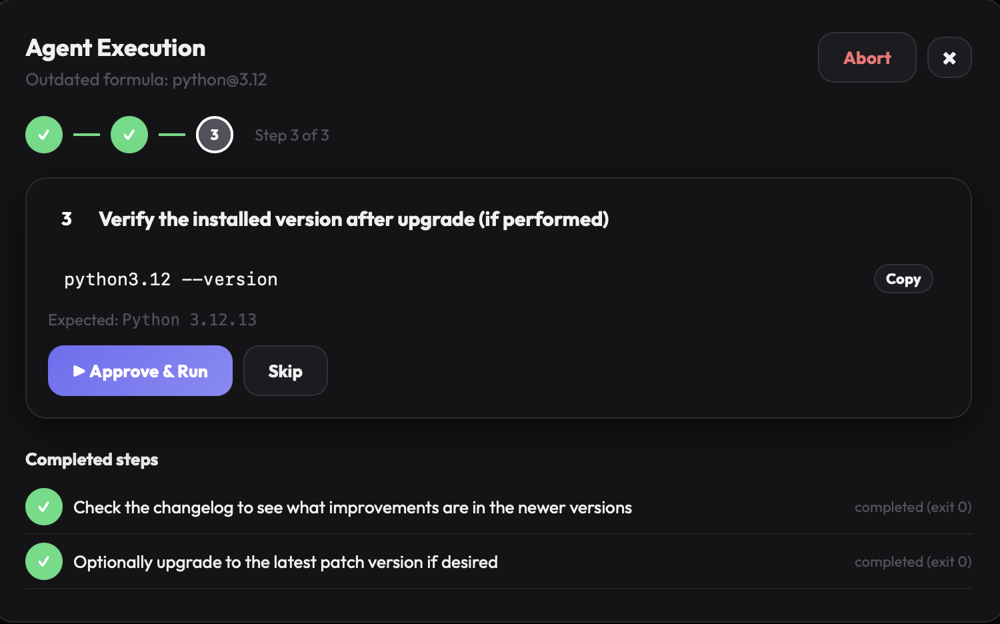
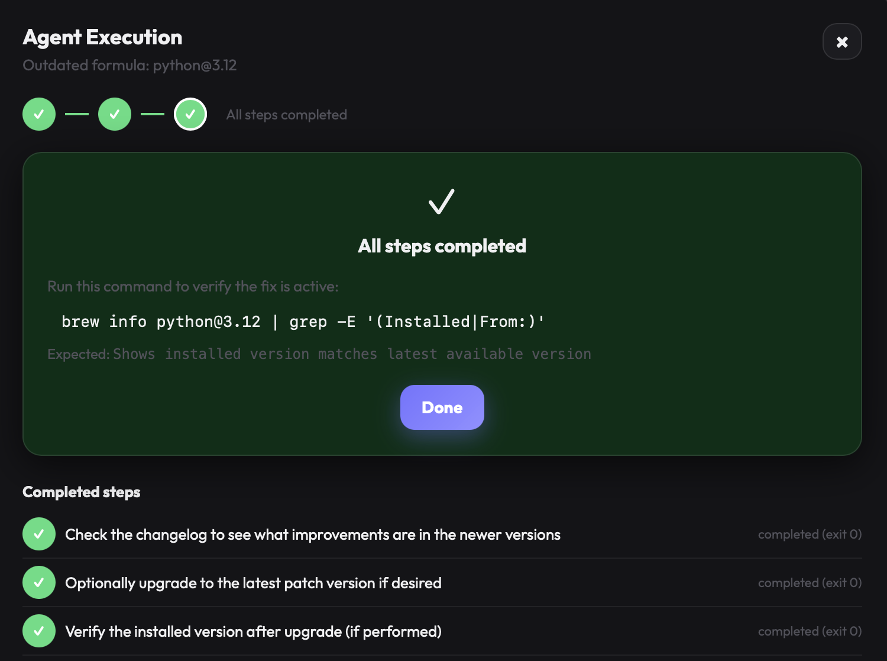
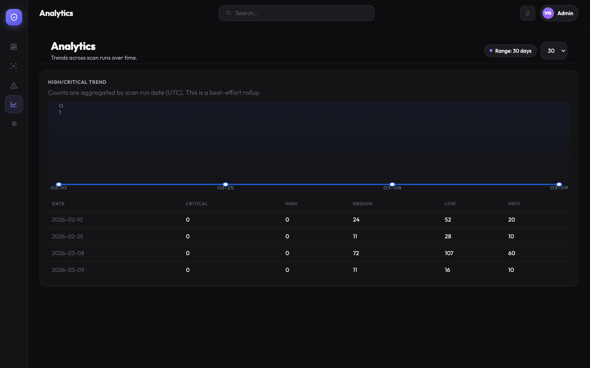

# 🛡️ Vigil

> ⚠️ **Disclaimer:** Vigil is a fun side project powered by AI. It is **not** production-grade security software. Findings may be incomplete, inaccurate, or miss real threats entirely. Do not rely on it as your sole security measure. Always review AI-suggested commands before running them, and never execute steps you don't understand. Use at your own risk — and have fun with it! 🙂

---

**😬 You install things from the internet every day. Most of them are fine. Some of them aren't.**

Every `brew install`, `pip install`, `npm install -g` is a small act of trust. A trust that the package has no known vulnerabilities. That it didn't sneak a persistent background process onto your machine. That your firewall is still on. That your SSH keys still have the right permissions.

Vigil keeps that trust honest.

It's a local-first macOS security dashboard that scans your machine, surfaces what's misconfigured or vulnerable, and uses AI to walk you through fixing it — one approved command at a time, with you in control.

🔒 No cloud. No telemetry. Runs entirely on `127.0.0.1`.

---

## 📸 Screenshots

### 📊 Security posture at a glance


### 🔍 Pick your scanners and run


### 🚨 Every finding, ranked by severity


### 🤖 AI explains the root cause and tells you exactly what to do


### ✋ Step-by-step execution — you approve every command before it runs


### ✅ All steps done — with a verification command to confirm the fix


### 📈 Track your security posture improving over time


---

## ⚙️ How it works

**1. 🔍 Run a scan**
Choose from 11 built-in scanners. Vigil inspects your system in seconds — firewall state, SSH key permissions, open TCP ports, launch agents, shell history secrets, outdated Homebrew packages, pip and npm CVE lookups, and more.

**2. 📋 Review what it found**
Every finding is ranked Critical → Info, tagged with its scanner, and tracked across runs. See what's new, what regressed, and what you've already fixed.

**3. 🤖 Ask AI to explain it**
Click **Get AI Fix** on any finding. Claude analyses the root cause, flags safety notes, and produces a numbered remediation plan with exact commands to run.

**4. ✋ Approve each step — nothing runs without you**
Hit **Run with Agent** and Vigil walks you through the fix one step at a time. You see the command, you read what it does, you press **Approve & Run**. Nothing happens silently. You can skip or abort at any point.

**5. 📈 Watch your posture improve**
The Analytics view tracks High/Critical counts across all your scan runs so you can see the trend moving in the right direction.

---

## 🔎 What it scans

| Scanner | What it checks |
|---|---|
| 🍎 macOS Hardening | Firewall, Gatekeeper, SIP, FileVault |
| 🔑 SSH Permissions | `~/.ssh` key and config file permission hygiene |
| 🤫 Environment Variable Secrets | Common credential patterns leaked into your shell env |
| 📜 Shell History Secrets | Passwords and tokens accidentally typed into bash/zsh |
| 👻 Launch Agents & Login Items | Unexpected persistence mechanisms (non-Apple startup items) |
| 🌐 Network Configuration | DNS, proxy, and interface security settings |
| 🚪 Listening TCP Ports | All open ports via `lsof` |
| 🍺 Homebrew Outdated | Formulae and casks with newer versions available |
| 🐍 pip Inventory | All installed Python packages |
| 📦 npm Global Inventory | All globally installed npm packages |
| 💀 OSV Vulnerabilities | Known CVEs for every inventoried pip and npm package via osv.dev |

---

## 🚀 Quickstart

### Backend
```bash
cd backend
python3.12 -m venv .venv
source .venv/bin/activate
pip install -e ".[dev]"
cp .env.example .env          # add SC_ANTHROPIC_API_KEY for AI features
python -m uvicorn security_check.app:app --host 127.0.0.1 --port 8000
```

### Frontend
```bash
cd frontend
npm install
cp .env.example .env
npm run dev
```

Open `http://localhost:5173`. 🎉

---

## 🤖 AI-powered fixes

Add your Anthropic API key to `backend/.env`:

```
SC_ANTHROPIC_API_KEY=sk-ant-...
```

All scanning works without it. The AI features (root cause analysis, remediation steps, and agent execution) activate once the key is set.

---

## 🛠️ Configuration

| Variable | Default | Description |
|---|---|---|
| `SC_ANTHROPIC_API_KEY` | — | 🤖 Enables AI fix generation and agent execution |
| `SC_ANTHROPIC_MODEL` | `claude-sonnet-4-5-20250929` | Claude model used for resolutions |
| `SC_DB_PATH` | `data/security-check.db` | SQLite database location |
| `SC_API_TOKEN` | — | 🔐 Optional Bearer token to protect the local API |
| `SC_OSV_API_BASE` | `https://api.osv.dev` | Set empty to disable CVE lookups |
| `SC_DISABLE_AI_RESOLUTION` | `false` | Disable AI features without removing the key |
| `SC_EXECUTION_ENABLED` | `true` | Allow step-by-step command execution from the UI |

---

## 🧩 Adding a scanner

1. Create a new scanner in `backend/src/security_check/scanners/`
2. Register it in `backend/src/security_check/runner.py` (`default_registry()`)
3. Restart the backend — it appears in the UI automatically ✨

---

## 🔒 Safety

- Backend binds to `127.0.0.1` only — never accessible from the network
- Scanners read metadata only (versions, permissions, ports) — no file content by default
- OSV checks send `package@version` to the public OSV API — no paths or personal data
- Every AI-suggested command requires your explicit approval before it runs
- Only run Vigil on machines you own or have explicit permission to assess
